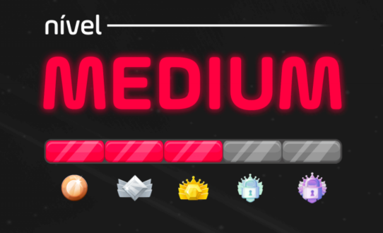

# Série de Desafios de Programação

Bem-vindo à série de desafios de programação! Esta coleção de desafios foi projetada para ajudar a aprimorar suas habilidades de codificação com problemas variados e interessantes. Cada desafio oferece uma oportunidade para praticar e aprender novas técnicas, ideal para desenvolvedores iniciantes e intermediários.

## Introdução

Os desafios nesta série foram criados para serem acessíveis e educativos. Eles cobrem uma gama de tópicos e conceitos, incluindo manipulação de arrays, processamento de strings, cálculos matemáticos, e mais. Ao completar esses desafios, você terá a chance de melhorar suas habilidades em JavaScript e outros aspectos fundamentais da programação.

### Desafios Incluídos:

1. **Conversão de Números Romanos**: Converta números romanos para decimais e visualize o resultado.
2. **Descriptografar Cifra de César**: Descriptografe textos cifrados usando a cifra de César.
3. **Inserir Palavras em Índices**: Insira uma palavra em vários índices dentro de uma frase.
4. **Resolver Equações Quadráticas**: Resolva equações quadráticas e visualize os passos e soluções.
5. **Calcular Persistência Multiplicativa**: Calcule a persistência multiplicativa de um número.
6. **Gerar Senhas**: Gere permutações de senhas com base em opções fornecidas.
7. **Coordenadas e Setores**: Armazena 3 coordenadas e determina em que setor se encontram.
8. **Verificar Números Faltantes**: Verifica se há elementos faltando em uma função.

## Missões detalhadas

1. **Para obter mais detalhes sobre cada missão e tentar realizá-las você mesmo, acesse esse PDF**:
[Visualizar PDF](https://drive.google.com/file/d/1bIKfpF1wFO6_J9bpq8HOBkh7aaPi780-/view?usp=drive_link)